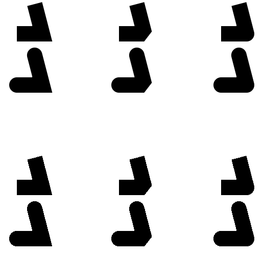

# PixiJS Smooth Graphics
PixiJS v6 plugin for making smooth shapes using HHAA shader.

## Features

This is very early version of the plugin.

Here's how it looks, compared to pixi graphics (antialias=false)



You can find examples in `examples` folder, you have to start the local webserver in repo folder to view them. 

### How to draw lines

This is drop-in replacement of `PIXI.Graphics`, API is compatible.

```js
import {SmoothGraphics as Graphics} from '@pixi/graphics-smooth';

const graphics = new Graphics();

graphics.moveTo(100, 100);
graphics.lineTo(200, 200);
```

There are differences with old graphics:
1. `alignment` is not supported yet
2. line `width` is always scale-independent

### How to draw fills

Fills have a bit of a problem - smoothing works good only on concave objects.
It works only on circles and polygons. It is not implemented for rects and rounded rects yet.  

```js
graphics.beginFill(0xffffff, 1.0, true); //third param for beginFill
```

HHAA doesn't work with texture fill yet.

### What are we working on

* better AA on fills
* support for line alignment
* support for line textures
* rope mode for line textures
* line scale modes

## Performance

Currently it uses 11 floats per vertex, when original graphics used only 8. Number of vertices also differ, it might use up to 2x of original.

Uniforms are used to store styles depends on (lineWidth, lineAlignment, texture, matrix).

If style buffer is too big (for now its max 24), one more drawcall will spawn.

In future we'll 

### What are we working on

* support [instancing](https://wwwtyro.net/2019/11/18/instanced-lines.html)
* support Uniform Buffer Objects
* support batching of multiple graphics elements

## Build & test

```bash
npm
npm run build
http-server -c-1
```

Open `examples/simple.html`
